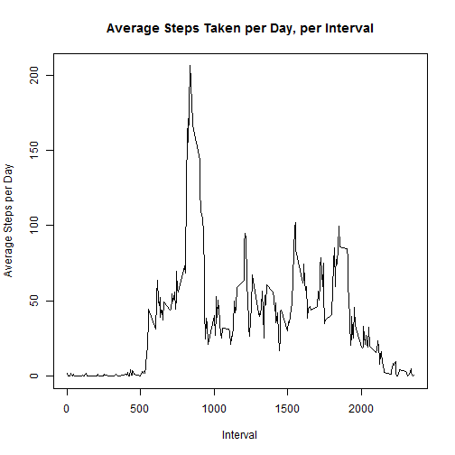

##Reproducible Research Assignment 1

<br>

**Loading and Processing the Data**


```r
activity <- read.csv('activity.csv', as.is = TRUE)
```

<br>

**What is the mean total number of steps taken per day?**

<br>

1. Calculate the total number of steps taken per day


```r
activity_nona <- activity[complete.cases(activity),]
library(plyr)
daytotals <- ddply(activity_nona, .(date), summarize, stepsperday = sum(steps, na.rm=TRUE))
```

<br>

2. Make a histogram of the total number of steps taken each day


```r
hist(daytotals$stepsperday, main = 'Histogram of Steps per Day', xlab = 'Steps per Day')
```


  
<br>

3. Calculate and report the mean and median of the total number of steps taken per day


```r
meansteps <- mean(daytotals$stepsperday)
mediansteps <- median(daytotals$stepsperday)
```

The mean number of steps taken per day is 1.0766189 &times; 10<sup>4</sup>.  
The median number of steps taken per day is 10765.  

<br>

**What is the Average Daily Activity Pattern?**  

<br>

1. Make a time series plot of the 5-minute interval (x-axis) and the average number of steps taken, averaged across all days (y-axis)


```r
intmeans <- ddply(activity_nona, .(interval), summarize, stepsperday = mean(steps, na.rm=TRUE))
plot(intmeans, type = "l", main = "Average Steps Taken per Day, per Interval", ylab = "Average Steps per Day", xlab = "Interval")
```



<br>

2. Which 5-minute interval, on average across all the days in the dataset, contains the maximum number of steps?

```r
maxsteps <- intmeans[which.max(intmeans$stepsperday),]
maxint <- maxsteps$interval
```

Interval 835 contains the maximum number of steps.

<br> 

**Inputting Missing Values**

<br>

1. Calculate and report the total number of missing values in the dataset 

```r
sumna <- sum(is.na(activity$steps))
```

The dataset contains 2304 missing values. 

<br>

2. Devise a strategy for filling in all of the missing values in the dataset. 
NA values will be replaced with the average steps per day for the interval

<br>

3. Create a new dataset that is equal to the original dataset but with the missing data filled in.

```r
activity2 <- merge(x = activity, y = intmeans, by = "interval", all.x = TRUE)
activity2$steps[is.na(activity2$steps)] <- activity2$stepsperday[is.na(activity2$steps)]
```

<br>

4. Make a histogram of the total number of steps taken each day and Calculate and report the mean and median total number of steps taken per day. Do these values differ from the estimates from the first part of the assignment? What is the impact of imputing missing data on the estimates of the total daily number of steps?

```r
daytotals2 <- ddply(activity2, .(date), summarize, stepsperday = sum(steps))
hist(daytotals2$stepsperday, main = 'Histogram of Steps per Day', xlab = 'Steps per Day')
```


```r
meansteps2 <- mean(daytotals2$stepsperday)
mediansteps2 <- median(daytotals2$stepsperday)
```

The mean number of steps taken per day is 1.0766189 &times; 10<sup>4</sup>.  
The median number of steps taken per day is 1.0766189 &times; 10<sup>4</sup>.  

Yes, the values differ from the first part of the assignment; the estimates increase. 

<br>

**Are there differences in activity patterns between weekdays and weekends?**

<br>

1. Create a new factor variable in the dataset with two levels - "weekday" and "weekend" indicating whether a given date is a weekday or weekend day.


```r
activity2$weekday <- weekdays(as.Date(activity2$date))
activity2$weekday2[activity2$weekday == c("Sunday","Saturday")] <- "weekend"
activity2$weekday2[activity2$weekday != c("Sunday","Saturday")] <- "weekday"
```

<br>

2. Make a panel plot containing a time series plot of the 5-minute interval (x-axis) and the average number of steps taken, averaged across all weekday days or weekend days (y-axis). 


```r
intmeans2 <- ddply(activity2, .(interval, weekday2), summarize, stepsperday = mean(steps))
par(mfrow = c(1,2))
wends <- intmeans2[intmeans2$weekday2 == "weekend" , c(1,3)]
wdays <- intmeans2[intmeans2$weekday2 == "weekday" , c(1,3)]
plot(wends, type = "l", main = "weekends")
plot(wdays, type = "l", main = "weekdays")
```


